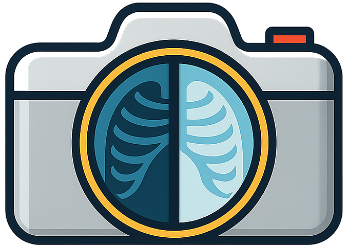

<!-- Add logo here -->
<h1 align="center">
  
  <strong>CCD: Mitigating Hallucinations in Radiology MLLMs via Clinical Contrastive Decoding</strong>
</h1>

<div align="center">

[](https://x-izhang.github.io/CCD/)
[](https://arxiv.org/abs/2509.23379) 
[](https://huggingface.co/spaces/X-iZhang/CCD)
[](https://huggingface.co/collections/X-iZhang/ccd-68b9f5db2f03525b465ee09c)
[](https://github.com/X-iZhang/CCD/blob/main/LICENSE)
[](https://visitorbadge.io/status?path=https%3A%2F%2Fgithub.com%2FX-iZhang%2FCCD)

</div>

## 🔥 News

- **[30 Sep 2025]** 🗂️ Processed test data for the [*MIMIC-CXR*](https://huggingface.co/datasets/X-iZhang/MIMIC-CXR-RRG), [*IU-Xray*](https://huggingface.co/datasets/X-iZhang/IU-Xray-RRG), [*CheXpert Plus*](https://huggingface.co/datasets/X-iZhang/CheXpert-plus-RRG) RRG task and [*Medical-CXR-VQA*](https://huggingface.co/datasets/X-iZhang/Medical-CXR-VQA) are now available on [Hugging Face Collections](https://huggingface.co/collections/X-iZhang/ccd-68b9f5db2f03525b465ee09c).
- **[27 Sep 2025]** ⛳ Our preprint is now live on [arXiv](https://arxiv.org/abs/2509.23379) — check it out for details.


## Overview
Multimodal large language models (MLLMs) are advancing radiology by combining image and text understanding, but often generate inaccurate or unsupported clinical details—so-called medical hallucinations. We propose **C**linical **C**ontrastive **D**ecoding (**CCD**), a *training-free* and *retrieval-free* inference framework that integrates structured clinical signals from task‑specific radiology expert models. **`CCD`** reduces hallucinations and improves clinical accuracy without changing the base model. Experiments show **`CCD`** boosts performance on multiple datasets and models, offering a practical way to make radiology MLLMs more reliable.

<details open>
<summary>CCD's Framework</summary>


</details>

## 📖 Contents
- [⛏️ Installation](#️-installation)
- [⚡ Quick Start](#-quick-start)
- [🛠️ Advanced Usage](#️-advanced-usage)
  - [Supported MLLM Models](#supported-mllm-models)
  - [Supported Expert Models](#supported-expert-models)
  - [Parameter Settings](#parameter-settings)
- [🗂️ Dataset](#️-dataset)
- [📊 Evaluation](#-evaluation)
- [📝 Citation](#-citation)
- [📚 Acknowledgments](#-acknowledgments)
- [📜 License](#-license)
- [🧰 Intended Use](#-intended-use)

## ⛏️ Installation

> [!TIP]
> We strongly recommend using [`uv`](https://pypi.org/project/uv) for installing the project — it's significantly faster and more reliable than `pip`.

### Option 1:
Install the latest version directly from GitHub for quick setup:

```bash
uv pip install git+https://github.com/X-iZhang/CCD.git
```

> [!NOTE]
> Requirements: Python 3.9 or later, and a CUDA-compatible GPU (recommended)

### Option 2: 
If you plan to modify the code or contribute to the project, you can clone the repository and install it in editable mode:

1. Clone the repository and navigate to the project folder

```bash
git clone https://github.com/X-iZhang/CCD.git
cd CCD
```

2. Set up the environment and install in editable mode

```bash
conda create -n CCD python=3.10 -y
conda activate CCD
pip install uv # enable uv support
uv pip install -e .
```

<details>
<summary> 🔄 Upgrade to the latest code base </summary>

```Shell
git pull
uv pip install -e .
```

</details>

## ⚡ Quick Start

### CLI Inference  
You can perform inference directly from the command line using our CLI tool:

```Shell
python -m ccd.run_ccd \
  --model-path "X-iZhang/libra-maira-2" \
  --image "./path/to/Chest_Xray.jpg" \
  --question "Is there evidence of any abnormalities?" \
  --max-new-tokens 128
```

**Optional arguments:**  

| Argument | Description | Default |
|-----------|--------------|----------|
| `--alpha` | Clinical guidance weight (range: 0.0–1.0) | 0.5 |
| `--beta` | Expert token weight (range: 0.0–1.0) | 0.5 |
| `--gamma` | Token bias magnitude (range: 1–20) | 10 |
| `--expert-model` | Choice of expert model: `"DenseNet"` or `"MedSiglip"` | DenseNet |

### Script Inference
You can run inference programmatically using the `ccd_eval` function from `ccd/run_ccd.py`.  
After installing this repository, you can easily launch a model (either your own trained model or ours) locally or in Google Colab.  


```python
from ccd import ccd_eval

# Run CCD inference on a chest X-ray
output = ccd_eval(
    model_path="X-iZhang/libra-maira-2",  # or your custom radiology MLLM
    image="./path/to/Chest_Xray.jpg",
    question="Describe the findings in this chest X-ray.",
    alpha=0.5,      # Clinical guidance weight
    beta=0.5,       # Expert token weight
    gamma=10,       # Token bias magnitude
    length_penalty=1.0,
    temperature=1.0,
    top_p=0.9,
    top_k=50,
    expert_model="DenseNet",  # or "MedSiglip"
    max_new_tokens=256
)
print(output)
```

<details>
<summary>💡 You can also use <code>run_eval</code> to test the original model output (without CCD).</summary>

```python
from ccd import run_eval

# Run standard inference without CCD
output = run_eval(
    model_path="X-iZhang/libra-maira-2",
    image="./path/to/Chest_Xray.jpg",
    question="Describe the findings in this chest X-ray.",
    max_new_tokens=128,
    num_beams=1
)
print(output)
```

</details>

### Gradio Web Interface  

You can launch the Gradio demo locally with:  

```bash
python -m ccd.app
```

Or try it directly on [🤗 **Hugging Face Spaces** 🤗](https://huggingface.co/spaces/X-iZhang/CCD).

## 🛠️ Advanced Usage

### Supported MLLM Models

CCD is compatible with any radiology MLLM that follows the **Libra/LLaVA** architecture:

> [!NOTE]  
> To switch MLLM models, simply set the `--model-path` argument (CLI) or `model_path` parameter (Python) to one of the following checkpoints.  

| Model | Checkpoint |
|--------|-------------|
| **Libra-v1.0-7B** | [X-iZhang/libra-v1.0-7b](https://huggingface.co/X-iZhang/libra-v1.0-7b) |
| **Libra-v1.0-3B** | [X-iZhang/libra-v1.0-3b](https://huggingface.co/X-iZhang/libra-v1.0-3b) |
| **MAIRA-2** | [X-iZhang/libra-maira-2](https://huggingface.co/X-iZhang/libra-maira-2) |
| **LLaVA-Med-v1.5** | [X-iZhang/libra-llava-med-v1.5-mistral-7b](https://huggingface.co/X-iZhang/libra-llava-med-v1.5-mistral-7b) |
| **LLaVA-Rad** | [X-iZhang/libra-llava-rad](https://huggingface.co/X-iZhang/libra-llava-rad) |
| **Med-CXRGen-F** | [X-iZhang/Med-CXRGen-F](https://huggingface.co/X-iZhang/Med-CXRGen-F) |
| **Med-CXRGen-I** | [X-iZhang/Med-CXRGen-I](https://huggingface.co/X-iZhang/Med-CXRGen-I) |


### Supported Expert Models

CCD integrates two expert models for **clinical signal extraction**:  

> [!NOTE]  
> To switch expert models, simply set the `--expert-model` argument (CLI) or `expert_model` parameter (Python) to one of the following names.  

| Model | Checkpoint |
|--------|-------------|
| **DenseNet** | [torchxrayvision/densenet121-res224-chex](https://huggingface.co/torchxrayvision/densenet121-res224-chex) |
| **MedSiglip** | [google/medsiglip-448](https://huggingface.co/google/medsiglip-448) |


### Parameter Settings

- **`alpha` (0.0-1.0)**: Weight for clinical guidance text
  - Higher = more influence from expert-generated guidance
  - Recommended: 0.3-0.7

- **`beta` (0.0-1.0)**: Weight for direct token biasing
  - Higher = stronger push toward clinical terminology
  - Recommended: 0.3-0.7

- **`gamma` (1-20)**: Maximum token bias magnitude
  - 2: Subtle influence
  - 5: Moderate influence
  - 10: Strong influence (default)

## 🗂️ Dataset  

CCD supports multiple medical imaging datasets commonly used in radiology research:  

- **MIMIC-CXR** — Chest X-ray images with corresponding radiology reports.  
- **IU-Xray** — Chest X-ray dataset with structured annotations.  
- **CheXpert** — Large-scale dataset for chest X-ray interpretation.  

> [!NOTE]  
> For evaluation, we provide pre-processed test splits for **MIMIC-CXR**, **IU-Xray**, and **CheXpert Plus**, available on [Hugging Face Collections](https://huggingface.co/collections/X-iZhang/ccd-68b9f5db2f03525b465ee09c).

## 📊 Evaluation  

For evaluating generated reports, we recommend using [**RadEval**](https://pypi.org/project/RadEval/) — a unified framework for radiology text evaluation that integrates multiple standard metrics.  

You can install RadEval via pip:  
```bash
pip install RadEval
```
> [!TIP]  
> RadEval supports metrics such as BLEU, ROUGE, BERTScore, CheXbert F1, and RadGraph F1, making it ideal for comprehensive evaluation of radiology report generation models.

## 📝 Citation

If you find our paper and code useful in your research and applications, please cite using this BibTeX:

```bibtex
@misc{zhang2025ccdmitigatinghallucinationsradiology,
      title={CCD: Mitigating Hallucinations in Radiology MLLMs via Clinical Contrastive Decoding}, 
      author={Xi Zhang and Zaiqiao Meng and Jake Lever and Edmond S. L. Ho},
      year={2025},
      eprint={2509.23379},
      archivePrefix={arXiv},
      primaryClass={cs.CL},
      url={https://arxiv.org/abs/2509.23379}, 
}
```

## 📚 Acknowledgments

This project builds upon several excellent open-source projects:

- [Libra](https://github.com/X-iZhang/Libra) - Temporal medical image analysis framework, with multiple radiology MLLMs
- [TorchXRayVision](https://github.com/mlmed/torchxrayvision) - Pretrained models for chest X-ray analysis
- [MedSigLIP](https://huggingface.co/google/medsiglip-448) - Medical Signal Language Image Pretraining

We thank the authors for their valuable contributions to the medical AI community.

## 📜 License

This project is licensed under the MIT License - see the [LICENSE](LICENSE) file for details.

## 🧰 Intended Use

**CCD** is designed to **assist** clinical practitioners, researchers, and medical trainees in generating and analysing **chest X-ray reports**, with a focus on **temporal reasoning** and **context-aware description** of radiological findings.

### Key Applications

- 🩺 **Clinical Decision Support** — Produces preliminary *findings* or *comparative analyses* that can aid radiologists in drafting and reviewing reports.  
- 🎓 **Educational Tool** — Demonstrates example interpretations and temporal progressions for teaching radiology residents and students.  
- 🔬 **Research Utility** — Enables investigation of automated report generation, visual-language alignment, and temporal feature learning in medical imaging.

>[!IMPORTANT]
> All outputs must be reviewed and validated by **qualified radiologists or medical professionals** before informing any clinical decision.

---

<details>
<summary><strong>Limitations and Recommendations</strong></summary>

1. **Data Bias** — Performance may degrade on underrepresented populations or rare disease categories.  
2. **Clinical Oversight** — CCD is a *supportive* system, not a replacement for professional medical judgment.  
3. **Temporal Sensitivity** — Although TAC enhances temporal alignment, subtle or atypical longitudinal changes may remain unrecognised.  
4. **Generalisation** — Performance may vary on image types or clinical contexts not present in the training distribution.  

</details>

<details>
<summary><strong>Ethical Considerations</strong></summary>

- **Patient Privacy** — All input data must be fully de-identified and compliant with **HIPAA**, **GDPR**, or equivalent local regulations.  
- **Responsible Deployment** — CCD’s outputs may contain inaccuracies; users should interpret them with appropriate caution.  
- **Accountability** — The responsibility for clinical verification and safe deployment lies with the **end-user organisation or researcher**.  

</details>

<details>
<summary><strong>Disclaimer</strong></summary>

This model and accompanying tools are intended **solely for research and educational purposes**.  
CCD is **not approved** by the **FDA**, **CE**, or other regulatory authorities for clinical use.  
For medical diagnosis or treatment decisions, please consult a **licensed healthcare professional**.  

</details>